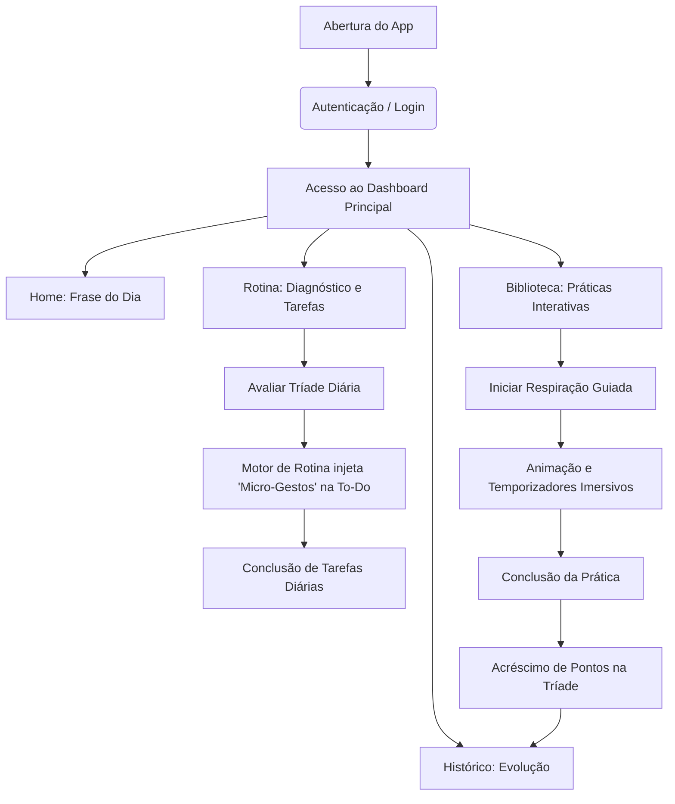

# 🌌 Present Time App

> **Equilíbrio diário entre produtividade moderna e saúde holística.**

O **Present Time App** é uma aplicação web focada no bem-estar e produtividade consciente. Diferente dos gerenciadores de tarefas convencionais que geram ansiedade através de checklists mecânicos, o Present Time propõe um ecossistema baseado na **Tríade do Equilíbrio: Físico, Mental e Espiritual**, ajudando o usuário a sair do piloto automático através de pausas ativas, micro-gestos personalizados e biofeedback gráfico em tempo real.

---

## 🚀 Funcionalidades Principais

*   **🔒 Autenticação Exclusiva (SPA):** Login e cadastro integrados de forma reativa em uma única página.
*   **📊 Diagnóstico da Tríade:** Avaliação diária de saúde física, mental e espiritual.
*   **🧠 To-Do List Inteligente:** Injeção automática de **Micro-Gestos de Foco** na lista de tarefas caso o motor do servidor detecte desequilíbrios na Tríade, ao lado de tarefas diárias comuns.
*   **🫁 Biblioteca de Práticas Interativas:** Exercícios de respiração guiada (como *Box Breathing* e *Respiração 4-7-8*) e meditações com temporizadores e animações imersivas do círculo pulmonar sincronizadas via CSS e Javascript.
*   **📈 Histórico de Evolução Dinâmico:** Visualização gráfica da evolução holística da Tríade ao longo do tempo utilizando gráficos de linhas animados renderizados com a biblioteca **Chart.js**.

---

## 🛠️ Tecnologias Utilizadas

O projeto foi construído sobre uma arquitetura leve e robusta, evitando frameworks pesados no frontend para garantir performance e simplicidade:

*   **Frontend:**
    *   **HTML5:** Estrutura semântica sob o modelo *Single-Page Application (SPA)*.
    *   **CSS3:** Design System responsivo baseado em **Glassmorphic Glass**, sombras suaves e animações de escala tridimensionais.
    *   **Vanilla JavaScript (ES6+):** Engine reativa para manipulação assíncrona do DOM, temporizadores da biblioteca de práticas e consumo de APIs.
    *   **Chart.js (CDN):** Renderização e animação do gráfico histórico.
    *   **Ionicons (CDN):** Biblioteca de ícones minimalistas.

*   **Backend:**
    *   **Node.js:** Ambiente de execução assíncrono para o servidor.
    *   **Express.js:** Framework minimalista para criação da API RESTful e distribuição dos arquivos estáticos do frontend.
    *   **Mock Database (Memória):** Estrutura em memória volátil (`src/data/mockDB.js`) contendo dados históricos e credenciais pré-carregadas para total portabilidade do MVP.

---

## 📊 Fluxograma do Processo

O fluxo de dados e a jornada do usuário dentro do aplicativo seguem as etapas integradas mapeadas abaixo. O GitHub renderiza este diagrama nativamente usando **Mermaid**:



---

## 📁 Estrutura de Diretórios

```bash
present-time-app/
├── public/                 # Arquivos públicos do Frontend (Estáticos)
│   ├── app.js              # Engine JavaScript principal e requisições Fetch
│   ├── index.html          # Estrutura semântica e telas da SPA
│   └── style.css           # Estilização visual, Glassmorphism e animações
├── src/                    # Código-fonte do Backend (Node.js)
│   ├── data/
│   │   └── mockDB.js       # Banco de dados simulado e sementes iniciais
│   ├── routes/
│   │   └── api.js          # Definições de rotas e lógica da API REST
│   └── server.js           # Inicialização do servidor Express
├── package.json            # Scripts e dependências do projeto
└── README.md               # Documentação explicativa
```

---

## 💻 Como Executar o Projeto Localmente

Para rodar a aplicação em sua máquina local, certifique-se de possuir o [Node.js](https://nodejs.org/) instalado e siga as instruções a seguir:

1. **Clone o repositório:**
   ```bash
   git clone https://github.com/guilhermelbrei/Presenttimeapp.git
   cd Presenttimeapp
   ```

2. **Instale as dependências:**
   ```bash
   npm install
   ```

3. **Inicie o servidor de desenvolvimento:**
   ```bash
   npm start
   ```
   *O terminal informará que o servidor está escutando na porta `3000`.*

4. **Acesse o App:**
   Abra seu navegador favorito e navegue até:
   👉 [http://localhost:3000](http://localhost:3000)

---

## 🔑 Credenciais para Teste (Apresentação Rápida)

Para facilitar a demonstração prática das funcionalidades completas do aplicativo (incluindo o gráfico de histórico de 7 dias previamente preenchido):

*   **E-mail:** `teste@teste.com`
*   **Senha:** `123`

---

## ⚖️ Licença

Este projeto é desenvolvido para fins acadêmicos e educacionais. Todos os direitos reservados.
